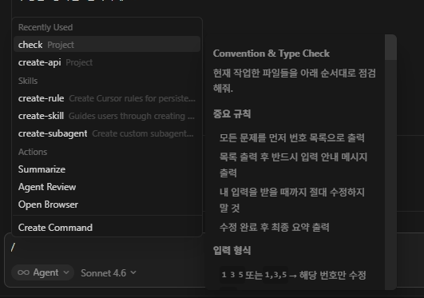
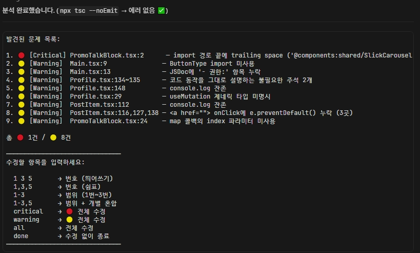
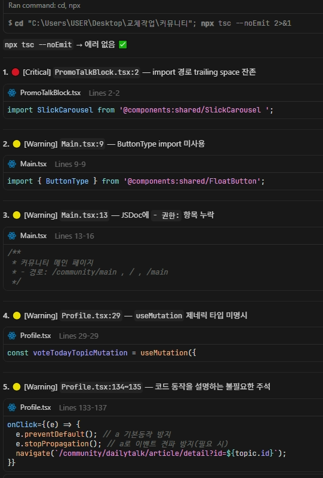
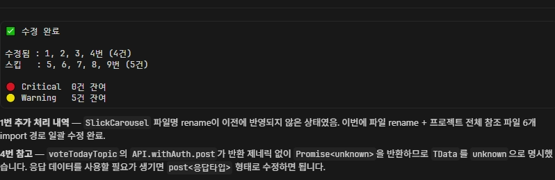
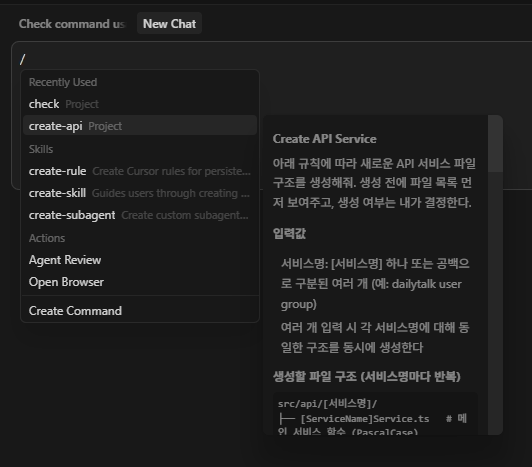
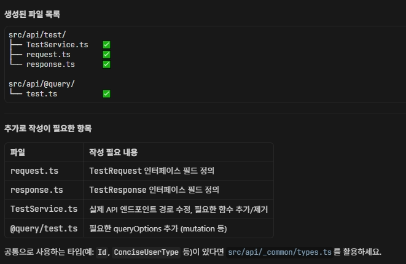
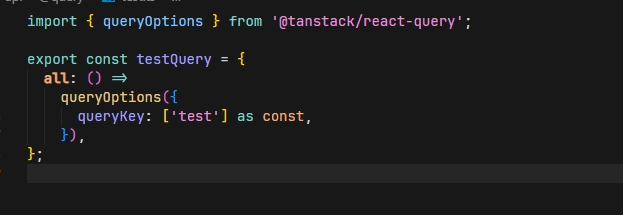

# Cursor AI Team Workflow

> React / TypeScript 프로젝트를 위한 Cursor AI 팀 자동화 워크플로우

## 개요

팀 컨벤션을 AI가 이해할 수 있는 Rules로 문서화하고,
커스텀 Slash Commands로 반복 작업을 자동화했습니다.
`.cursor/` 폴더를 Git으로 공유해 팀 전체가 동일한 AI 환경에서 작업합니다.

## 구조

.cursor/
├── rules/
│ ├── index.mdc # 프로젝트 기본 컨벤션
│ └── typescript.mdc # TypeScript 규칙
└── commands/
├── check.md # 컨벤션 + 타입 점검
└── create-api.md # API 파일 생성

## 사용법

### 팀 적용

git clone [프로젝트 레포]

# Cursor로 열면 Rules 자동 적용

### /check — PR 전 점검

`Cmd+L → /check @파일명.tsx`

컨벤션, 네이밍, JSDoc, 타입 오류를 순서대로 점검합니다.
문제 목록을 번호로 출력하고, 수정 여부는 개발자가 직접 선택합니다.

분석이 완료되면 발견된 문제를 번호 목록으로 출력하고, 수정할 항목을 선택합니다.

선택한 항목에 대해 수정 내용을 상세히 보여줍니다.

수정이 완료되면 최종 요약을 출력합니다.

### /create-api — API 파일 생성

`/create-api dailytalk`

컨벤션에 맞는 API 서비스 파일 구조를 자동 생성합니다.

컨벤션에 맞게 필요한 파일 목록을 생성합니다.

생성된 파일에는 TanStack Query 패턴이 적용됩니다.

## 기술 스택

Vite 4 / React 18 / TypeScript 5
Redux Toolkit 2 / TanStack Query v5
React Hook Form 7